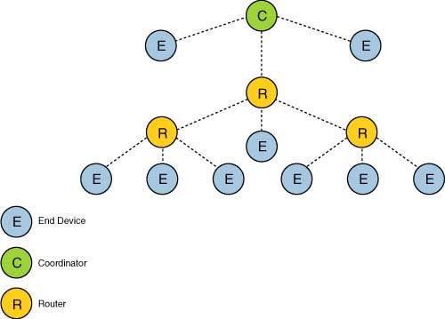
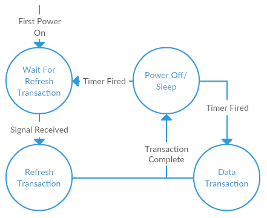

# Loom Peer Network Stack

The following defines a specification for how the Loom peer network stack will be built. This file does not define how devices will communicate outside of this network.

A key aspect of the Loom network design is the ability to power cycle the device and maintain network connectivity. This allows a device to hard power-down for extended periods of time, increasing battery life significantly.

All numbers in this document are LSByte and LSBit.

## Components

The Loom Network Peer Network Stack will be divided into 3 layers:
```
+--------------+ 
| Network      | 
+--------------+
       |
+--------------+   
| MAC          |     
+--------------+   
       |
+--------------+
| Radio        |
+--------------+     
```
* **Network** - Handles routing, retries, addressing, topology, and will be interfaced with by a Loom developer.
* **MAC** - Medium access control, will ensure that every packet is sent and acknowledged without collision, determining when a device is allowed to send or receive.
* **Radio** - A hardware abstraction layer allowing the above layers to interface with any device.

As found in many other network layers, each layer shall only interface with the one above and below it.

## Network

The network layer shall consist of three components: Routing, retransmission, and application interface. 

### Routing



The topology(layout) of the network shall be predefined in a JSON structure, shown in [configuration](TODO). The layout shall consist of three types of devices: Coordinator, Router, and End device:
  * The *Coordinator* will serve as the central router and scheduler for the Loom network. All traffic sent by devices will be to a single Coordinator, and all traffic received from devices will be from the Coordinator. There will be a single Coordinator per network.
  * A *Router* will serve as an intermediate between a Coordinator and an End device, relaying data up the star to the Coordinator and back. Routers will spend more time transmitting and receiving, but will otherwise behave similarly to an endpoint device.
  * An *Endpoint Device* represents a Loom sensor device. These devices will send/receive data from a Router or a Coordinator. An End device can only communicate with a Router or Coordinator.

These devices may be interconnected, forming a path. A valid topology of paths is defined as follows:
* All paths must be between two devices.
* A device can only have one path to another device.
* No combination of paths and devices shall form a circular pattern.
* An endpoint device may not create a path to another endpoint device.
* A router must have at least one path to either another router or the coordinator, and at least one path to an endpoint device.
* The number of routers between an endpoint device and a coordinator shall not exceed 2.

Based on the above topology, the network layer shall assign addresses to each device based on an address spaces algorithm, specified below:
* The Coordinator is granted the address of `0xF000`, and the address `0x0000` shall be reserved.
* An address shall be split into three components:
```
+--------------+---------------+---------+
| First Router | Second Router | Node    |
| 4 Bits       | 4 Bits        | 8 Bits  | 
+--------------+---------------+---------+
```
* Where:
  * First router: The address of the router closest to the coordinator on the path from the node to the Coordinator, starting from 1 and not including 16. If there is no router in between the end device and Coordinator, this value is zero.
  * Second router: The address of the router farthest from coordinator on the path from the node to the Coordinator, starting from 1. If there is less than two routers between the end device and coordinator, this value is zero.
  * Node: The address of the end device itself, starting from 1. If this value is zero, the address is referring to the last router with a non-zero address.
* Routers with paths to the Coordinator shall be assigned only the First Router component with the rest zero, and Routers one hop from the Coordinator shall be assigned the First Router from their parent and the Second Router as themselves with Node set to zero. Finally, each End Device is assigned a address in the Node field, inheriting First Router and Second Router from it's parents. Each time a field is assigned, it does so sequentially starting from 1 in order of appearance in the configuration. 

The above address scheme limits Routers per device to 14, and nodes per router to 254.

The network layer shall automatically handle packet passing if the device is not the destination, determining the next destination using the internal routing configuration.

### Retransmission

A Loom Network Stack shall assume that the MAC layer will allow transmission at any time to a coordinator, however no other device will have this capability.

If the MAC layer indicates a transmission failure, the network can attempt to retry a transmission during it's next allocated time slot. After 5 consecutive failures, both the receiving node and the transmitting node are assumed to be operating incorrectly, and this information is sent to the coordinator and the MAC layer for further action. The data can be dropped or retransmitted at a later time. If the packet dropped is in a sequence, the entire sequence is dropped.

### Application

The Loom Network Stack shall allow for any arbitrary data to be sent/received by the device. To send data, a developer shall specify a destination and a payload. The address of the destination shall be a string, later converted to a unique two-byte address. A developer shall assume an arbitrary latency for any transmission, excluding transmissions to a coordinator. In order to facilitate large data payloads, the network layer shall automatically split payloads, fragmenting and sequencing during transmission and reassembling on the other end.

In order to use Loom Network Stack, the developer must provide a medium of storing data across a hard-reset. The loom network stack shall use this medium to store data across powered-off sleep states, hereafter referred to as sleep. 

The following diagram illustrates valid states of the loom network stack:
```
               +-----------------+                                                          
               | Power Off/Sleep |                                                            
               +-------^---------+                                              
                    /--   \--                                                   
                 /--         \--                                                
              /--               \--                                             
           /--                     \--                                          
+---------v------+           +--------v---------+                               
| Refresh Period |<--------->| Data Transaction |                                               
+----------------+           +------------------+     
```
The state of the network stack shall be determined by the MAC layer. The network layer shall maintain a queue of data to send, and a queue of data been received, and shall indicate a failure in the MAC layer. 

### Packet Structure

The network shall format it's data as follows (this data will be surrounded by the MAC layer data):
```
-----+--------------+-------------+---------+----------+----------+---------+----
     | Frame Length | Destination | Source  | Sequence | Reserved | Payload |
     | 8 Bits       | 16 Bits     | 16 Bits | 8 bits   | 8 bits   | n bits  |
-----+--------------+-------------+---------+----------+----------+---------+----
```
Where:
* **Frame Length**: The size of the network packet in bytes (Frame Length + Destination + Source + Reserved + Payload). Unsigned byte, can be no more than 255.
* **Destination**: The 16-bit address of the final destination.
* **Source**: The 16-bit address of the original source (not to be confused with the current source, which is handled in the MAC layer).
* **Sequence**: The number of packets remaining in a sequence of fragments, indexed from zero (ex. A two fragment sequence would have sequence numbers 1 and then 0).
* **Reserved**: Discard.
* **Payload**: A sequence of data bytes (no larger than 246 bytes long).

## MAC

Use modified TMAC shown [here](http://www.cs.umd.edu/~moustafa/papers/IMPACCT2002.pdf). Time sync based off of a periodic refresh signal from the gateway and routers. Each time slot an endpoint does a three part handshake with it's respective router:
 * Send Data to router
 * Receive ACK from router, and receive upstream data from router
 * Send ACK to router.



The Loom MAC will operate in three states: Power Off/Sleep, Refresh Transaction, and Data Transaction. A refresh transaction shall synchronize a node to the network, and a data transaction shall facilitate sending data between two devices. Both these events and shall happen periodically at pre-programmed rates, and shall not overlap. It is recommended to have a refresh transaction after a fixed number of data transactions.

A coordinator shall indicate the exact timings of refresh and data transactions during a refresh transaction, and a router shall relay this information if needed. If a device is neither in a refresh transaction or data transaction, the device is permitted to sleep until the next transaction. If the device has not received a refresh transaction from a coordinator or router (i.e. the device is new to the network) the device shall listen to the network until it receives a valid refresh transaction (indicated with "wait for refresh transaction" on the state diagram).

### Refresh Transaction

Periodically, a Coordinator shall trigger a refresh cycle by broadcasting a refresh packet, to be received by routers. This packet shall contain only the next wakeup times and intervals for the refresh and data periods. The routers and coordinator shall then rebroadcast this data to all of the nodes, in reverse order of time slot priority. If a node does not receive a refresh signal, it assumes data from the last refresh signal received. If a node were to perform this action consecutively, the node instead assumes it has malfunctioned and continues listening for another refresh signal.

If a coordinator would like to send additional routing data during a refresh period, it can do so using the count field of a refresh packet. The Coordinator may chose to repeat this transmission cycle with arbitrary data, signaling using the count field of the initial refresh packet. The initial refresh packet shall always contain synchronization data and shall be a brief packet (to ensure proper synchronization), however further packets may be any length and content. A refresh cycle is finished when a refresh packet is transmitted with count==0. Note that this data is unacknowledged, and that any misheard data is dropped---because of this characteristic, care shall be taken to ensure the state of the node shall not cause conflict should the node fail to receive a refresh.

#### Packet Format

| Three-Bit Code | Time Unit |
| --- | --- |
| 000 | Microseconds |
| 001 | Milliseconds |
| 010 | Seconds (RTC Recommended) |
| 011 | Minutes (RTC Recommended) |
| 100 | Hour (RTC Recommended)   |
| 101 | Days (RTC Recommended)     |
| 110 | Reserved |
| 111 | Reserved |

Initial Refresh Packet
```
----+------------------+-------------+----------------+----------+--------+----
    | Interval Control | Data Offset | Refresh Offset | Reserved | Count  |
    | 8 Bits           | 8 Bits      | 16 Bits        | 8 Bits   | 8 Bits |
----+------------------+-------------+----------------+----------+--------+----
```

Where:
* **Control**: See data transaction packet format.
* **Interval Control**:
  * Bits 0-2: Time units for Data Offset (see table above)
  * Bits 3-6: Time units for Refresh Offset (see table above)
  * Bits 7-8: Reserved
* **Data Offset**: The amount of time from the end of the transmission of this packet to the first time slot for a Data transaction, in units specified by *interval control*. Must be at least greater than the time needed to complete the refresh cycle.
* **Refresh Offset**: The amount of time from the end of the transmission of this packet to the next refresh cycle, in units specified by *interval control*.
* **Reserved**: Discarded.
* **Count**: The number of consecutive refresh packets following this one (unsigned byte).
* **FCS**: See data transaction packet format.

Additional refresh packet
```
----+--------------+----------+---------+----
    | Frame Length | Reserved | Payload |
    | 8 Bits       | 8 Bits   | n Bits  |
----+--------------+----------+---------+----
```

Where:
* **Frame Length**: The size of the refresh packet in bytes, not including the control frame. (Frame Length + Reserved + Payload + FCS) as an unsigned byte.
* **Reserved**: Discard.
* **Payload**: A sequence of data bytes (no longer than 251 bytes)

### Data Transaction

Each device shall determine it's own time slot using network topology configuration, using a reverse breadth-first search. The algorithm shall treat the network topology as a tree with the Coordinator on top, and shall operate as follows:
* The tree is divided into layers, where each layer is defined by the number of devices in-between the device and the coordinator.
* The end device on the greatest layer (with greatest number of routers on it's path from bottom to top) is chosen as the first node to transmit. If there are more than one node on the greatest layer, the one with the lowest address is chosen.
* For every layer starting from the greatest layer, nodes are sub-ordered first by router, and then by address lowest-first.
  * Routers on the layer above are ordered by lowest address first, and then the end-devices are sub-ordered by lowest address. This allows routers to receive data from children devices in a single large window.
* A fixed window time slot is assigned based on capability and child devices. Time slots for a given device are always consecutive.
  * A single time slot is granted for sensing capabilities.
  * A time slot is granted to a router for each device in a lower layer with:
    * a path to the router being granted slots, and 
    * sensing capabilities.  

A device, upon entering it's designated time slot, can transmit data to an upstream coordinator or router. This data transmission takes place in three parts:

* **Data Transmission**: The device sends it's payload using the *Data Transmission* packet format. The device then turns on the receiver to wait for a response.
* **ACK/Reverse Data Transmission** The receiving router/coordinator sends an acknowledgement using the *ACK* format, or alternatively the *ACK with Data* packet format if upstream data is available for the device. If the router/coordinator sent upstream data to the device, the router/coordinator turns on it's receiver and waits for a response.
* **ACK** If the device received upstream data, it send back a final *ACK* to the router/coordinator, and resumes sleep.

In addition to it's transmission period, a router shall remain listening to the network during its end devices' time slots. A coordinator shall be awake at all times.

The number of data transactions per refresh cycle shall be provided in the device configuration, in addition to a data transaction interval in milliseconds. Data transactions shall happen consecutively every interval until the limit has been reached or the next refresh transaction, and then shall idle or sleep if the transactions are finished early.
#### Packet Format

| Three-Bit Code | Packet Type |
| --- | --- |
| 100 | Initial Refresh/Sync Data |
| 011 | Additional Refresh/Sync Data |
| 001 | Error |
| 101 | Data Transmission |
| 110 | Data ACK |
| 111 | Data ACK w/ Transmission |
| 010 | Reserved |

The *Data transmission* and *ACK with Data* packets shall be formatted as follows:
```
+---------+---------+----------------+---------+
| Control | Source  | Network Packet | FCS     |
| 8 Bits  | 16 Bits | 56-250 Bytes   | 16 Bits |
+---------+---------+----------------+---------+
Where:
```
* **Control**
  * Bits 0-2: Packet type, shown in table above.
  * Bits 3-4: Protocol version, as of this draft 0.
  * Bits 4-5: Reserved.
* **Source** The address of the device that sent this packet. Not to be confused with the original source, which is ignored by the MAC layer.
* **Network Packet** See the network packet structure.
* **FCS** A verification mechanism calculated using a 16-bit CRC with the polynomial `x^16+x^12+x^5+1`. The calculation of this value shall include the entire packet structure, excluding the checksum itself.

The *ACK* packet shall be formatted as follows:
```
+---------+---------+
| Control | Source  |
| 8 Bits  | 16 Bits |
+---------+---------+
```
* **Control**
  * Bits 0-2: Packet type, shown in table above.
  * Bits 3-4: Protocol version, as of this draft 0.
  * Bits 4-5: Reserved.
* **Source** The address of the device that sent this packet. Not to be confused with the original source, which is ignored by the MAC layer.


## Radio (Needs Revising)

A radio being used by the Loom Network Stack shall be capable of:
* Instant transmission/receiving.
* Detecting radio channel activity.
* Maintaining functionality through power cycling.
* Operating through a collision.

It is assumed that power consumption is transmission > receiving > detecting activity.

A radio shall transition from the following states:
```C++
                                  (Radio ON)
+----------+  Enable    +-------+  Receive   +---------+   Transmit    +----------+
|          |----------->|       |----------->|         |-------------->|          |
| Disabled |            | Sleep |            | Receive |               | Transmit |
|          |<-----------|       |<-----------|         |<--------------|          |
+----------+  Disable   +-------+   Sleep    +---------+   Receive     +----------+
```
If a radio transitions between states, it shall notify the MAC layer of this transition. In addition, a radio shall upon transmission failure, but shall not attempt to retransmit. It is preferred that data sent over the air be only from the MAC layer.

Additionally, a radio shall have an implementation of a method to create unique addresses from 

## Configuration

```JSON
{
       "root" : {
              "name": "BillyTheCoord",
              "sensor": false,
              "children": [
                     {
                            "name": "End Device 1",
                            "type": 0
                     },
                     {
                            "name": "Router 1",
                            "sensor": false,
                            "type": 1,
                            "children": [
                                   {
                                          "name": "Router 1 End Device 1",
                                          "type": 0
                                   },
                                   {
                                          "name": "Router 1 End Device 2",
                                          "type": 0
                                   },
                                   {
                                          "name": "Router 1 Router 1",
                                          "sensor": false,
                                          "type": 1,
                                          "children": [
                                                 {
                                                        "name": "Router 1 Router 1 End Device 1",
                                                        "type": 0
                                                 }
                                          ]
                                   },
                                   {
                                          "name": "Router 1 Router 2",
                                          "sensor": true,
                                          "type": 1,
                                          "children": [
                                                 {
                                                        "name": "Router 1 Router 2 End Device 1",
                                                        "type": 0
                                                 },
                                                 {
                                                        "name": "Router 1 Router 2 End Device 2",
                                                        "type": 0
                                                 }
                                          ]
                                   },
                                   {
                                          "name": "Router 1 End Device 3",
                                          "type": 0
                                   }
                            ]

                     },
                     {
                            "name": "Router 2",
                            "sensor": true,
                            "type": 1,
                            "children": [
                                   {
                                          "name": "Router 2 End Device 1",
                                          "type": 0
                                   }
                            ]
                     }
              ]
       }
}
```
